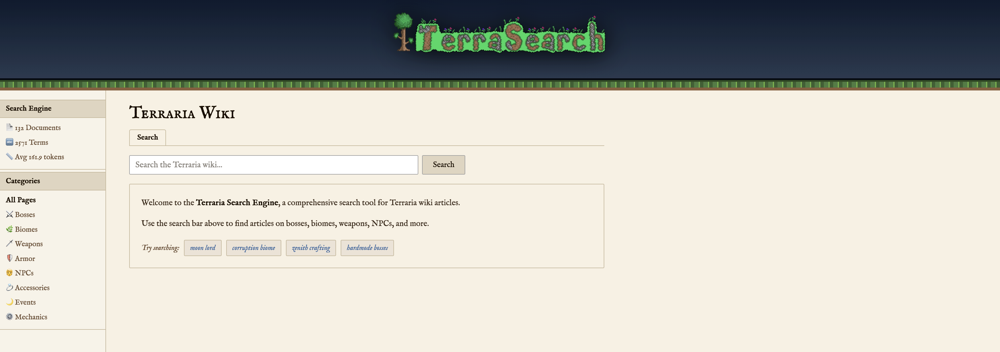
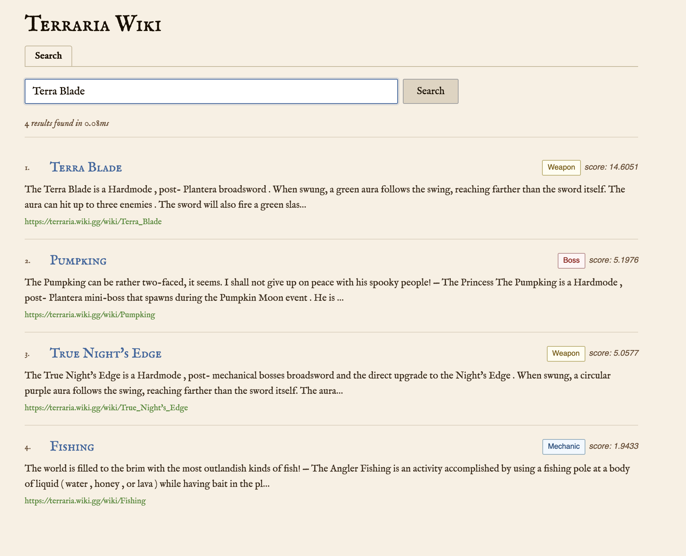

# Terraria Search Engine

**Alejandro Costich**
Information Retrieval — Custom Search Engine Project

---

## Domain

For this project I built a small search engine using content from the **Terraria Wiki**, the official wiki for Re-Logic’s game *Terraria* (2011). The game has sold more than 60 million copies, and its wiki contains a lot of structured information about bosses, weapons, mechanics, and progression systems.

I chose Terraria because the game naturally leads to complex searches such as:

* "how to unlock hardmode"
* "best sword after plantera"
* "corruption biome enemies"
* "how to summon moon lord"

These types of queries make it a good test case for an information-retrieval system.

The corpus used in this project contains **30 documents** divided into five categories:

* Bosses
* Biomes
* Weapons
* Events
* Mechanics

Each document was scraped from the official wiki and stored locally in JSON format.

---

## Enhancement G — Spell Correction

Spell correction was implemented using **Levenshtein edit distance** and the engine’s own vocabulary.

During indexing, every unstemmed token found in the corpus is stored in a vocabulary set (around 1600 unique words).
When a query is made, each word is checked against this vocabulary.

If a word is not found, the engine searches for the closest match with edit distance ≤ 2.

To make this faster, a simple length filter is used before computing the full distance:

```
abs(len(a) - len(b)) > max_distance
```

This avoids running the dynamic-programming algorithm on words that are obviously too different.

If a correction is found:

* The UI shows **Did you mean …**
* If the original query returns no results, the corrected query is used automatically

Examples:

```
skelton  → skeletron
plantra  → plantera
zeneth   → zenith
```

---

## Running locally (without Docker)

```bash
python3 -m venv .venv
source .venv/bin/activate

pip install -r requirements.txt

# optional
python scraper.py

uvicorn app:app --reload

open http://localhost:8000
```

---

## Running with Docker

```bash
docker compose up --build

open http://localhost:8000

docker compose down
```

---

## Project Structure

```
terraria-search/
├── README.md
├── corpus.json
├── scraper.py
├── search_engine.py
├── app.py
├── templates/
│   └── index.html
├── static/
│   ├── style.css
│   ├── main.js
│   └── images/
├── requirements.txt
├── Dockerfile
└── docker-compose.yml
```

* **scraper.py** → one-time wiki scraper
* **search_engine.py** → text processing, inverted index, BM25, spell correction
* **app.py** → FastAPI server
* **index.html** → search UI
* **main.js** → frontend logic
* **style.css** → theme

---

## API Endpoints

| Method | Route                                        | Description      |
| ------ | -------------------------------------------- | ---------------- |
| GET    | `/`                                          | Main page        |
| GET    | `/search?q=moon+lord&top_k=10&category=Boss` | Search           |
| GET    | `/stats`                                     | Index statistics |
| GET    | `/index-view?term=zenith`                    | Posting list     |

---

## Screenshots





---

## Corpus Source

All documents were scraped from:

https://terraria.wiki.gg

This wiki is maintained by the community and licensed under
CC BY-NC-SA 3.0.
